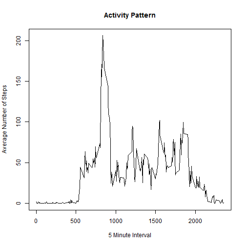
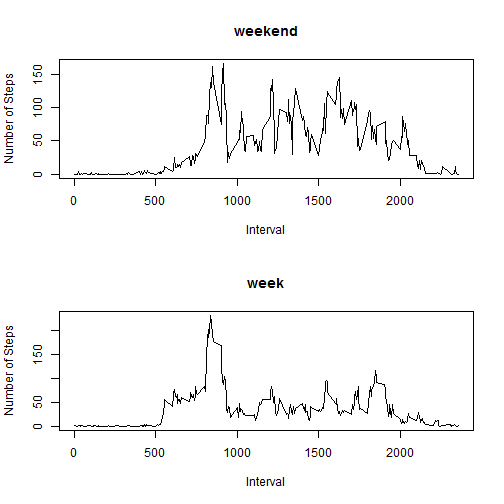

```
## Loading required package: gsubfn
## Loading required package: proto
## Loading required package: RSQLite
## Loading required package: DBI
```


# Loading and preprocessing the data
Read data into variable "df" from working directory


```r
df <- read.csv("activity.csv")
```

# Mean total number of steps taken per day
Total number of steps taken per day:

```r
tot<- sqldf("SELECT date, SUM(steps) AS [totalsteps] FROM df WHERE steps is not NULL  GROUP BY date")
hist(tot$totalsteps, main = "Histogram of total steps", xlab = "Total Steps")
```

 

Mean of steps taken per day:

```r
mean(tot$totalsteps,na.rm = TRUE)
```

```
## [1] 10766.19
```

Median of steps taken per day:

```r
median(tot$totalsteps,na.rm = TRUE)
```

```
## [1] 10765
```

# Average daily activity patern
Timeseries of 5-minute intervals:

```r
avg<- sqldf("SELECT interval, avg(steps) AS [avgsteps] FROM df WHERE steps <> 'NA' GROUP BY interval")
plot(avg$interval,avg$avgsteps,type = "l", xlab = "5 Minute Interval", ylab = "Average Number of Steps", main = "Activity Pattern")
```

 

The interval with the maximum average number of steps accross all the days in the data set is:

```r
sqldf("SELECT interval FROM avg WHERE avgsteps in (SELECT max(avgsteps) [max] FROM avg) ")
```

```
##   interval
## 1      835
```


# Missing values
Total number of 'NA' values in the column 'steps':

```r
sum(is.na(df$steps))
```

```
## [1] 2304
```

Creating new dataset with 'NA' values populated as mean for that day.

```r
##1. calculate mean of the day for non NA records
dfm<- sqldf("SELECT interval, avg(steps) AS [avgsteps] FROM df WHERE steps IS NOT NULL GROUP BY interval")


##2. Create dataframe of isolated NAs
dfna<- sqldf("SELECT * FROM df WHERE steps IS NULL")

##3. Create datafram where NAs are replaced with the daily avergage
dfc<- sqldf("SELECT b.avgsteps,a.date,a.interval
             FROM dfna as a
             LEFT JOIN dfm as b
             ON a.interval = b.interval")

##4. isolate records which are non NA
dfok<- sqldf("SELECT * FROM df WHERE steps IS NOT NULL")

##5. Append complete records with populated NAs as interval average
dfnew<- sqldf("SELECT steps, date, interval FROM dfok
              UNION ALL
               SELECT avgsteps as [steps], date, interval FROM dfc")
##6. Roll up steps per day
dfnews<- sqldf("SELECT date, SUM(steps) [totalsteps] FROM dfnew GROUP BY date")
hist(dfnews$totalsteps, main = "Histogram of total steps (populated NAs)", xlab = "Total Steps")
```

 

Mean of steps taken per day when NAs populated with average steps per interval:

```r
mean(dfnews$totalsteps,na.rm = TRUE)
```

```
## [1] 10749.77
```

Median of steps taken per day when NAs populated with average steps per interval:

```r
median(dfnews$totalsteps,na.rm = TRUE)
```

```
## [1] 10641
```

Populating the NA records had an increas in frequency of daily the daily totals occuring accross the test period.
The mean and median have slightly decreased.

#Weekdays vs. Weekend days


```r
##1. add weekday do the dataset
dfnew$wd<- weekdays(as.Date(dfnew$date))

##2. Set a factor variable for weekend and weekdays into a new dataset
dffinal <- sqldf("SELECT *, CASE WHEN wd in ('Saturday','Sunday') THEN 'weekend' ELSE 'week' END [FV]
                  FROM dfnew")


##3. Split out Weekend and weekday data
dfsplit <- sqldf("SELECT FV, interval, avg(steps) AS [avgsteps] FROM dffinal  GROUP BY FV, interval")
dfwe <- sqldf("SELECT interval, avg(steps) AS [avgsteps] FROM dffinal WHERE FV = 'weekend' GROUP BY interval")
dfwd <- sqldf("SELECT interval, avg(steps) AS [avgsteps] FROM dffinal WHERE FV = 'week' GROUP BY interval")

##4. Create Panel Plot (combination of multiple plots)

par(mfrow = c(2,1))
with (dfsplit, {
  plot(avgsteps ~ interval, dfsplit[dfsplit$FV == "weekend",], 
       type = "l",
       main = "weekend", 
       xlab = "Interval",
        ylab = "Number of Steps")
  plot(avgsteps ~ interval, dfsplit[dfsplit$FV == "week",], 
       type = "l", 
       main = "week", 
       xlab = "Interval",
       ylab = "Number of Steps")
})
```

 

